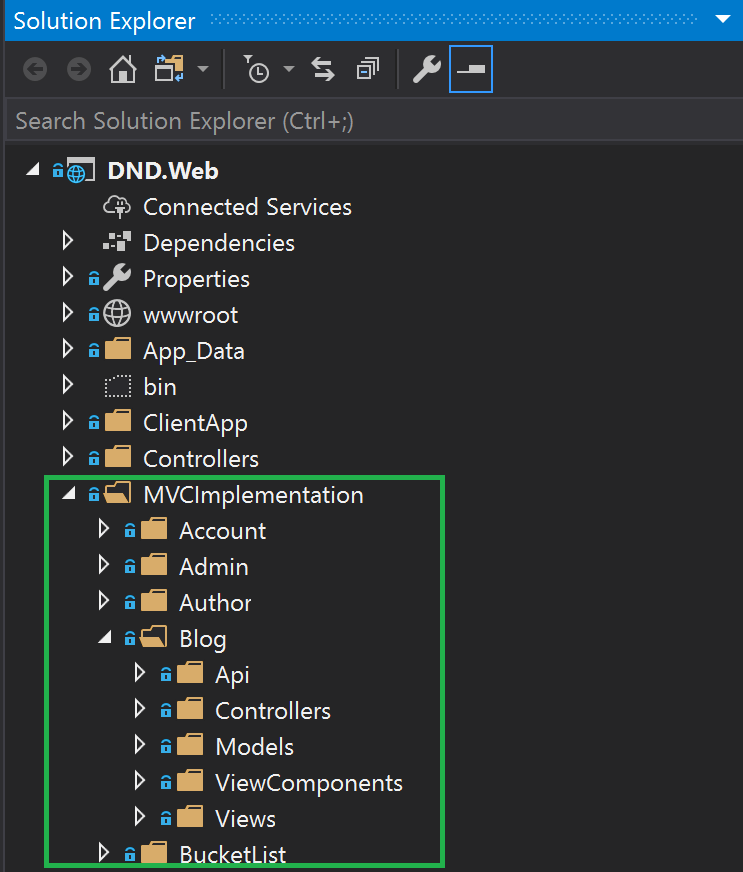
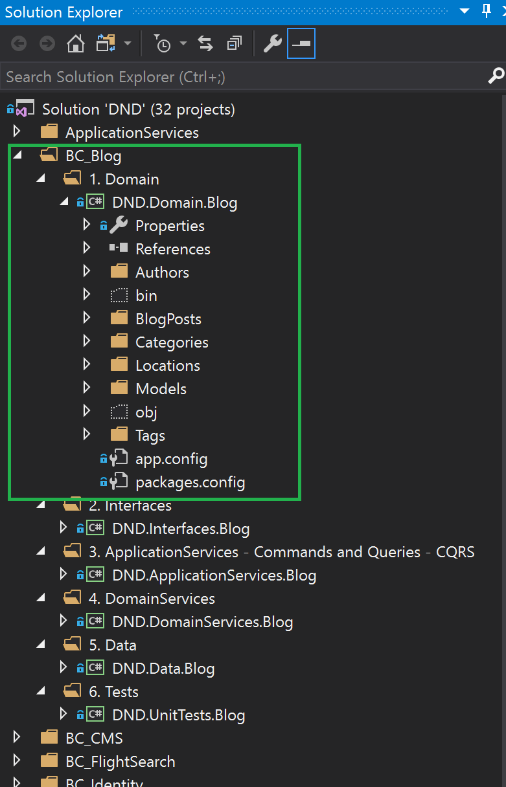
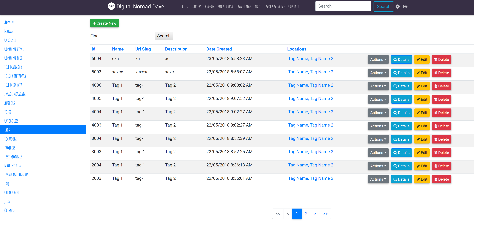
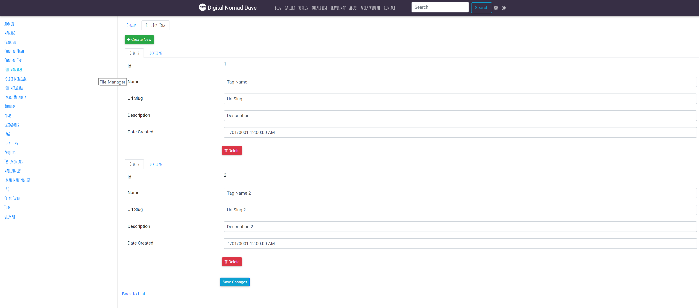
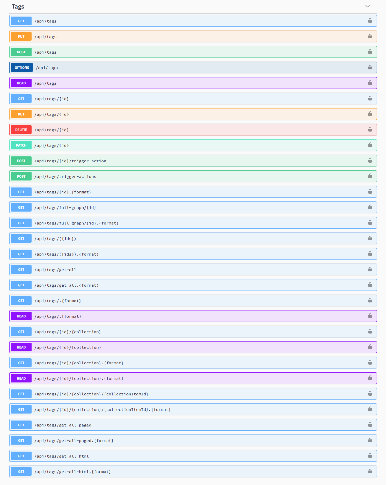

## Organization

Wherever possible I have opted for Business Component (Functional) organization over Categorical organization. 
It's very easy to stick with the standard structure but organizing into business components makes it alot easier to maintain and gives ability to easily copy/paste an entire piece of functionality.

###  MVC
This can be achieved in ASP.NET Core by creating a custom view locator implementing IViewLocationExpander.

+ Mvc
    + Aggregate Root
		+ Models
		+ Views
		+ Controllers
		



###  Bounded Context
This can be achieved at an assembly level by creating an Assembly per Bounded Context

+ Bounded Context
    + Aggregate Root
        + Entity



## Domain Driven Design, Generic Admin MVC UI and Api
When I started looking into building a generic admin UI and Api that could handle any data model it became clear that the following rules would need to be adhered to when creating the data model. Alot of the rules are the basis of Domain Driven Design.
1. Never have Many-To-Many relationships. Create a join Entity so the relationship becomes 1-To-Many and Many-To-1.
2. Never have 1-To-1 Composition/Owned ENTITY Relationships. For Composition relationships use Value types instead if required. In EF6 extend from BaseValueObject. In EF Core decorate value type with [OwnedAttribute]. Not sure if this attribute can be applied on base class. ValueTypes are included by default.
3. Use collections only for Composition/Owned relationships(1-To-Many, child cannot exist independent of the parent). Don't use collections for Aggregation/Associated relationshiships(child can exist independently of the parent, reference relationship). Never use a Collection for Navigation purposes.
4. All Aggregation/Associated Properties should have an associated Id property.
5. Use Complex properties for Aggregation/Associated relationships only (Many-To-1, child can exist independently of the parent, reference relationship). These become Navigation properties.

Once I adhered to the above rules I was able to expose the following actions in a generic way for both admin MVC UI and Api.

| Action				          | Api Http Method | Api Route								|UI Http Method      | UI Route									   | Security Scope								 |
| -------				          | --------		| --------								| ------			 | --------                                    | --------                                    |
| GetList/Search				  | GET				| api/*items*							| GET				 | admin/*items*                               | api.read									 |
| Details with Owned Collections  | GET				| api/*items*/*1*						| GET				 | admin/*items*/details/*1*                   | api.read									 |
| Full Graph Details		      | GET				| api/*items*/full-graph/*1*			| GET				 |							                   | api.read                                    |
| GetCreate				          | GET				| api/*items*/new						| GET				 | admin/*items*/new						   | api.create									 |
| Create				          | POST			| api/*items*							| POST				 | admin/*items*/new						   | api.create									 |
| BulkCreate				      | POST			| api/*items*/bulk						| 					 | 											   | api.create									 |
| GetUpdate				          | GET				| api/*items*/edit/*1*					| GET				 | admin/*items*/edit/*1*					   | api.update									 |
| Update				          |	PUT				| api/*items*/*1*						| POST				 | admin/*items*/edit/*1*	                   | api.update									 |
| Update Partial				  |	PATCH			| api/*items*/*1*						|					 |											   | api.update									 |
| GetBulkUpdate				      | GET				| api/*items*/bulk/edit/*1,2,3*			| 				     | 											   | api.update									 |
| BulkUpdate				      |	PUT				| api/*items*/bulk						| 					 |											   | api.update								     |
| BulkPatchUpdate				  |	PATCH			| api/*items*/bulk						| 					 |											   | api.update									 |
| GetDelete				          | GET				| api/*items*/delete/*1*				| GET				 | admin/*items*/delete/*1*					   | api.delete									 |
| Delete				          | DELETE			| api/*items*/*1*						| POST				 | admin/*items*/delete/*1*					   | api.delete									 |
| GetBulkDelete				      | GET				| api/*items*/bulk/delete/*1,2,3*		| 				     | 											   | api.delete									 |
| BulkDelete				      | DELETE			| api/*items*/bulk						| 				     | 											   | api.delete									 |
| GetCollectionList		          | GET				| api/*items*/*1*/*collection*			| GET				 | admin/*items*/details/*1*/*collection*      | api.read									 |
| GetCollectionListItem		      | GET				| api/*items*/*1*/*collection*/*10*		| GET				 | admin/*items*/details/*1*/*collection*/*10* | api.read									 |
| GetCreateCollectionListItem     | GET				| api/*items*/new/*collection*			| GET				 | admin/*items*/new/*collection*			   | api.write									 |
| TriggerAction					  | POST			| api/*items*/*1*/trigger-action		| GET				 | admin/*items*/*1*/trigger-action			   | api.update									 |
| BulkTriggerAction				  | POST			| api/*items*/bulk/trigger-action		| GET				 | admin/*items*/*1*/trigger-action			   | api.update									 |
| GetOptions					  | OPTIONS			| api/*items*							|					 |											   | api.read									 |
| Notifications					  | WebSocket		| api/*items*/notifications				| 					 |											   | api.notifications							 |

## Domain Events
* [Domain events: design and implementation](https://docs.microsoft.com/en-us/dotnet/standard/microservices-architecture/microservice-ddd-cqrs-patterns/domain-events-design-implementation)

From my personal experience alot of things (emails, correspondence) in business applications need to get triggered when an entity is inserted/updated/deleted or a property is changed.\
This functionality is often built into service methods or achieved using Domain Events.\
I read alot of .NET Core articles related to deferred domain events which require the programmer to add domain events to an Aggregate Root collection property which are then dispatched either before or after DbContext SaveChanges() is called.\
Although the Aggregate Root collection is needed for complex business logic triggers, I wanted a more generic approach for simple triggers and the ability to fire Before AND after SaveChanges(). I develped an approach where events are fired each time an entity is inserted/updated/deleted & property change.\
Once then events are fired the IDomainEventHandler interface allows the programmer to write PreCommit and PostCommit code.\
The PreCommit actions are atomic and can be used for chaining transactions. Once an exception is thrown nothing is commited. \
The PostCommit events are independent and by default are handed off to [Hangfire](https://www.hangfire.io/) for processing out of process. This would be useful for sending emails and correspondence.\
The key to the PreCommit functionality is using a Unit of Work pattern which is which is aware of the [Ambient DbContext](http://mehdi.me/ambient-dbcontext-in-ef6/), this ensures a DbContext is only ever created for the first call. Any subsequent inner calls use the same DbContext.\
Because determining if a property has changed relies on fetching the original values from the DB for each entity instance, Interface IFirePropertyUpdatedEvents needs to be applied to the entity to opt-in to property update events.\
For performance reaons an event is only ever fired if there is at least one Handler for that event type.\
The methods IDomainEvent methods HandlePreCommitCondition and HandlePostCommitCondition can be used for scenarios where you only want to handle PreCommit or PostCommit.\
Below is the intended design pattern and an example of two IDomainEventHandlers. Note: This is still a work in progress.


```C#
 public class Tag
{
    public string Name
    { get; set; }
}

public class TagInsertedEventHandler : IDomainEventHandler<EntityInsertedEvent<Tag>>
{
	public bool HandlePreCommitCondition(EntityInsertedEvent<Tag> domainEvent)
	{
		return true;
	}

    public async Task<Result> HandlePreCommitAsync(EntityInsertedEvent<Tag> domainEvent)
    {
        var before = domainEvent.Entity;

        return Result.Ok();
    }

	public bool HandlePostCommitCondition(EntityInsertedEvent<Tag> domainEvent)
	{
		return true;
	}

    public async Task<Result> HandlePostCommitAsync(EntityInsertedEvent<Tag> domainEvent)
    {
        var after = domainEvent.Entity;

            //Send Email

        return Result.Ok();
    }

}
```

```C#
 public class Category : IFirePropertyUpdatedEvents
{
    public string Name
    { get; set; }
}

public class CategoryPropertyUpdatedEventHandler : IDomainEventHandler<EntityPropertyUpdatedEvent<Category>>
{
    private ITagDomainService _tagService;
    public CategoryPropertyUpdatedEventHandler(ITagDomainService tagService)
    {
        _tagService = tagService;
    }

    public bool HandlePreCommitCondition(EntityPropertyUpdatedEvent<Category> domainEvent)
    {
        return true;
    }

    public async Task<Result> HandlePreCommitAsync(EntityPropertyUpdatedEvent<Category> domainEvent)
    {
        var before = domainEvent.Entity;
        if(domainEvent.PropertyName == "Name")
        {
            //Trigger creating/updating another db record
        }

        return Result.Ok();
    }

	public bool HandlePostCommitCondition(EntityPropertyUpdatedEvent<Category> domainEvent)
    {
        return true;
    }

    public async Task<Result> HandlePostCommitAsync(EntityPropertyUpdatedEvent<Category> domainEvent)
    {
        var after = domainEvent.Entity;
        if (domainEvent.PropertyName == "Name")
        {
            //Send Email
        }

        return Result.Ok();
    }
}
```

## Jwt Tokens, OpenID Connect and Identity Server 4

Todo

## Whats Next

Make generic UI compatible with any complex Dto datastructure. Convention first, configured by model data attributes where necessary.





Make generic RESTful API compatible with any complex Dto datastructure. Convention first, configured by model data attributes where necessary.

